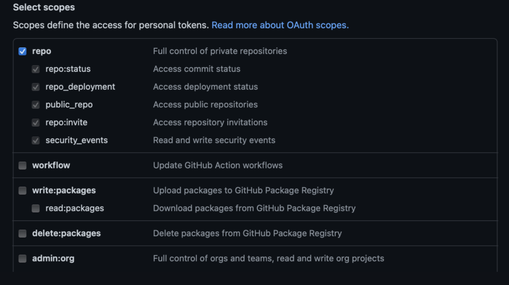

# Setup Lightdash to connect to your dbt project on GitHub

In this tutorial, you'll setup Lightdash and connect it to your dbt project on [GitHub](https://github.com).
Using GitHub as the backend is the recommended way to connect Lightdash to your production dbt project. This way,
Lightdash will only update when you merge code changes into your production branch (e.g. `main`).

**Prerequisites**
 - A dbt project on github. You'll need the repository name
 - Your dbt project shoud have a template `profiles.yml` file in it. See below
 - A heroku account. We'll use heroku to deploy your own self-hosted lightdash instance. [Signup for free here](https://heroku.com)

## 1. Check `profiles.yml` in github

Lightdash needs a [`profiles.yml`](https://docs.getdbt.com/dbt-cli/configure-your-profile) to run you dbt project.

You can add a template `profiles.yml` file to your repo **without any secrets** by using environment variables. This
allows us to add these secret values later. For example, a snowflake profile would look like this:

```yaml
# profiles.yml
my-snowflake-db:
  target: prod
  outputs:
    prod:
      type: snowflake
      account: "{{ env_var('SNOWFLAKE_ACCOUNT') }}"
      user: "{{ env_var('SNOWFLAKE_USER') }}"
      password: "{{ env_var('SNOWFLAKE_PASSWORD') }}"
...
```

## 2. One-click deploy to Heroku

Click to deploy the latest version of Lightdash to heroku. This provides a secure, production-ready deployment connected
to your dbt project in GitHub:

[](https://heroku.com/deploy?template=https://github.com/lightdash/lightdash-deploy-heroku-github)

Note if you don't have a Heroku account, you'll be prompted to signup. It's free to deploy Lightdash!

## 3. Fill in your credentials + config

After you hit deploy, you'll be asked to provide some credentials and config to connect to your dbt project in GitHub:

#### GITHUB_BRANCH
This is the branch in your GitHub repo that Lightdash should sync to. e.g. `main`, `master` or `dev`

By default, we've set this to `main` but you can change it to whatever you'd like.

#### GITHUB_PERSONAL_ACCESS_TOKEN
This is used to access your repo. See the [instructions for creating a personal access token here](https://docs.github.com/en/github/authenticating-to-github/keeping-your-account-and-data-secure/creating-a-personal-access-token).

Select `repo` scope when you're creating the token.



#### GITHUB_REPO
This should be in the format `my-org/my-repo`. e.g. `lightdash/lightdash-analytics`

#### LIGHTDASH_SECRET
Heroku generates a secret key for us. This is to secure everyone’s individual deployment (it encrypts the session tokens used to log you in).

You can't access this key and you can't change this key (so don't worry if you're not able to click on it!)

Just leave this field as it is.

#### PROFILES_SUB_PATH
This is the folder where your dbt `profiles.yml` file is found in the `GITHUB_REPO` you entered above.

By default, we've set this to be in the main folder of your repo.

If your `profiles.yml` file is in a sub-folder of your repo, then you'll need to include the relative path to the sub-folder where it is (relative to `GITHUB_REPO`).

Here's an example:
- my `GITHUB_REPO` is `lightdash/lightdash-analytics`
- the path to my `profiles.yml` file is `lightdas/lightdash-analytics/profiles/profiles.yml`
- so, my `PROFILES_SUB_PATH` would be `/profiles`

#### PROJECT_SUB_PATH
This is the folder where your `dbt_project.yml` file is found in the `GITHUB_REPO` you entered above.

If your `dbt_project.yml` file is in the main folder of your repo (e.g. `lightdash/lightdash-analytics/dbt_project.yml`), then you don't need to change anything in here. You can just leave the default value we've put in.

If your dbt project is in a sub-folder in your repo (e.g. `lightdash/lightdash-analytics/dbt/dbt_project.yml`), then you'll need to include the path to the sub-folder where your dbt project is relative to `GITHUB_REPO` (e.g. `/dbt`).

## 4. Deploy your Lightdash app instance

Heroku will show that it's setting up and deploying Lightdash. When it's complete you should see an option to manage
your Lightdash app. Click here to see the Heroku dashboard for you Lightdash instance:


## 5. Add the secrets for your `profiles.yml`

If you open your Lightdash app now, it will show an error because we haven't added the `profiles.yml` environment
variables.

In your heroku app settings, open the config vars tab:


For each `"{{ env_var('name') }}"` in your `profiles.yml` you need to add it to your heroku deployment config vars. In this example
we're adding a value for `SNOWFLAKE_USER`:


## 6. Launch Lightdash and setup your Lightdash account

Heroku will automatically update and restart your Lightdash app after you've changed your config vars. Once the
app has finished redeploying, hit "open app" in the dashboard:


As the first user for Lightdash, you'll be prompted to create an admin account to secure your instance:
