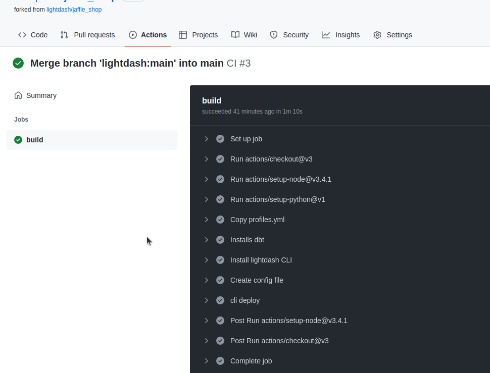

# Sync your changes with Lightdash deploy

## `lightdash deploy` syncs the changes in your dbt project to Lightdash

If you've made some changes to your dbt project and you'd like to make them available in your Lightdash project, you can easily do this using the `lightdash deploy` command in the Lightdash CLI tool.

```shell
git checkout main # checkout main or master - or whatever your production branch name is where you've merged your changes
git pull
lightdash deploy # --target prod. If you use developer profiles in your dbt project, you might need this flag. See below.
```

This will deploy the changes in your dbt project to the Lightdash project you set up on your CLI tool earlier.

:::info

**Note:** Lightdash's deploy commnd will deploy using your **default dbt target** unless you specify to use a different target. For example, if you've set up a developer profile where it targets a dev dataset (like `dbt_khindson.my_model_names`), then you'll need to pass the production target in your `lightdash deploy` command. Something like: `lightdash deploy --target prod`.

:::

And voilà! Once it's completed click the URL to head straight to your project where your changes will be ready to be explored.

## Automatically deploy your changes to Lightdash using a GitHub action

If you've connected Lightdash to GitHub, you can setup a `github action` and get Lightdash to deploy your project automatically. This is the easiest way to keep Lightdash in sync with your changes in dbt.

### Step 1: add the credentials to Github secrets

We are going to add some secrets and config to GitHub actions, 
but you don't want those to be public , so the best way to do this is to add them as secrets on Github

Go to your repo, click on `Settings` , on the left sidebar, click on `Secrets` under `Security`. 
Now click on the `New repository secret`


We need the following credentials, you can find them on the app, 
or in your `~/.config/lightdash/config.yaml` file on your machine if you have used the Lightdash CLI already.

- `LIGHTDASH_API_KEY`: Your personal access token on Lightdash. [See these instructions](https://docs.lightdash.com/guides/cli/cli-authentication#:~:text=First%2C%20you%27ll%20need%20to%20create%20a%20new%20personal%20access%20token%20in%20the%20UI%20by%20going%20to%20Settings%20%3E%20Personal%20Access%20Tokens.%20You%20can%27t%20use%20an%20existing%20personal%20access%20token!%20You%20have%20to%20create%20a%20new%20one%20just%20for%20yourself.) for creating a personal access token in the app.
- `LIGHTDASH_PROJECT`: The UUID for your project. For example, if your URL looks like `https://eu1.lightdash.cloud/projects/3538ab33-dc90-aabb-bc00-e50bba3a5f69/tables`, then `3538ab33-dc90-45f0-aabb-e50bba3a5f69` is your `LIGHTDASH_PROJECT`  
- `LIGHTDASH_URL`: (like https://eu1.lightdash.cloud or https://app.lightdash.cloud)
- `DBT_PROFILES`: Copy your full profiles.yml file into this secret, like:

```yaml
jaffle_shop:
  target: dev
  outputs:
    dev:
      type: snowflake
      account: abcd
      user: test
      password: ****
      role: SYSADMIN
      database: database
      warehouse: warehouse
      schema: jaffle_shop
```

### Step 2: Create action.yml workflow in Github

Go to your repo, click on `Actions` menu, and click on `Configure`


Now copy [this file](https://github.com/lightdash/cli-actions/blob/main/action.yml) from our [cli-actions](https://github.com/lightdash/cli-actions) repo.

And save by clicking on `Start commit`

### You're done!

Everytime you make a change to your repo, on the `main` branch, 
it will automatically deploy your new config into your Lightdash projects

You can see the log on `Github actions` page


