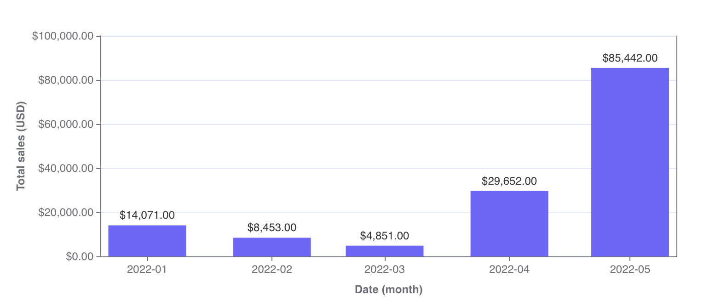

# Visualizing your results

Results tables can be useful for finding specific numbers or checking out your data, but it's usually easier to see trends and make sense of your data using charts.

In Lightdash, the data in your results tables can be visualized in a bunch of different ways:

To change how your data is displayed, go into the `charts` tab in the Explore view. You have the option to change the chart type shown by selecting a style from the drop-down:

you can also adjust all of the configuration settings for your chart type by clicking on the `configure` button:

Once you've finished creating your chart, you can share it using the URL,  save the chart, download it as an image, or save it to a dashboard.

## Chart types and options

Each chart type has its own configuration options. Click the `configure` button next to the chart type in the `chart` tab to see your options.

### Big number

The Big number option is for displaying a single number, well, big.

The Big number only works for numeric values. It will always pick the first value from the field in your results table as the number to display.

The options for Big numbers include:

- Updating the label below the big number value.

### Table

The Table option is good for looking at (surprise, surprise) tabular data, or for lists of things like user IDs or transactions. 

### Column and line charts

#### Column charts

Column charts are helpful to compare things between different groups (e.g. the number of orders you have by product type) or to track how a number changes over time if you have a smaller number of x-axis values (e.g. number of new users per month over a year). 

You can also stack column graphs to compare proportions across different groups.

#### Line charts

Line charts are used to show changes in a number over a short or long period of time. When smaller changes exist, or you have lots of x-axis values, line charts are better to use than column graphs.

Line charts with multiple lines can also be used to compare changes over the same period of time for more than one group.

#### Bar charts

Bar charts are just column charts, except the columns are placed on the chart horizontally instead of vertically. Bar charts are useful when you're trying to group a number by something with a lot of possible values. They're also useful if your groups have really long label names.

#### Scatter chart

A scatter chart is useful if you want to to look at the relationship, a.k.a. correlation, between two variables. Something like 

