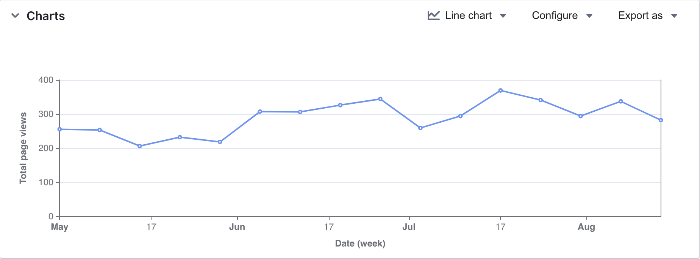
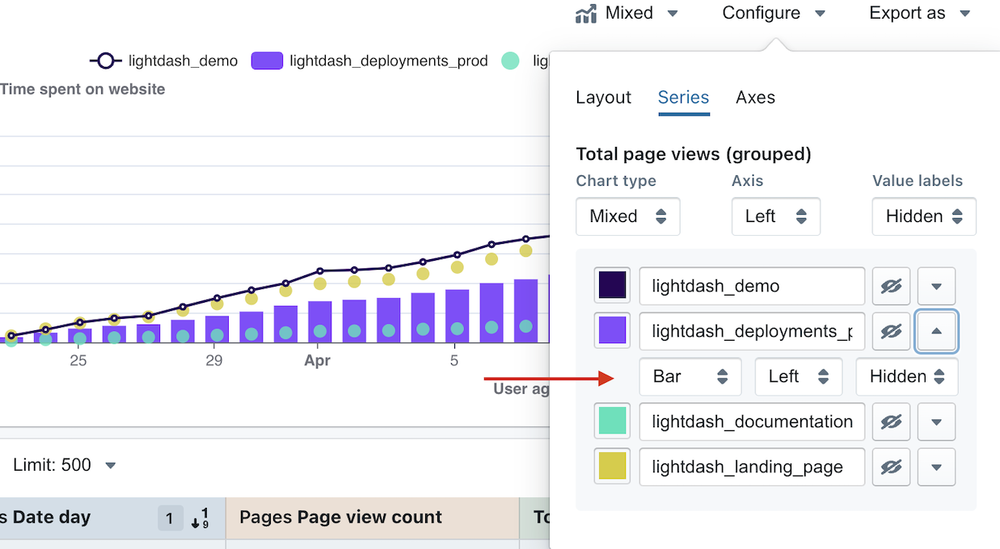

# Visualizing your results

Results tables can be useful for finding specific numbers or checking out your data, but it's usually easier to see trends and make sense of your data using charts.

In Lightdash, the data in your results tables can be visualized in a bunch of different ways:

- [Big Number](#big-number)
- [Table](#table)
- [Column chart](#column-chart)
- [Line chart](#line-chart)
- [Bar chart](#bar-chart)
- [Scatter chart](#scatter-chart)
- [Mixed chart](#mixed-chart)

To change how your data is displayed, go into the `charts` tab in the Explore view. You have the option to change the chart type shown by selecting a style from the drop-down:

you can also adjust all of the configuration settings for your chart type by clicking on the `configure` button:

Once you've finished creating your chart, you can share it using the URL,  save the chart, download it as an image, or save it to a dashboard.

## Chart types and options

Each chart type has its own configuration options. Click the `configure` button next to the chart type in the `chart` tab to see your options.

### Big number

The Big number option is for displaying a single number, well, big.

The Big number only works for numeric values. It will always pick the first value from the field in your results table as the number to display.

The options for Big numbers include:

- Updating the label below the big number value.

### Table

The Table option is good for looking at (surprise, surprise) tabular data, or for lists of things like user IDs or transactions. 

### Column chart

Column charts are helpful to compare things between different groups (e.g. the number of orders you have by product type) or to track how a number changes over time if you have a smaller number of x-axis values (e.g. number of new users per month over a year). 

You can also stack column graphs to compare proportions across different groups.

### Line chart

Line charts are used to show changes in a number over a short or long period of time. When smaller changes exist, or you have lots of x-axis values, line charts are better to use than column graphs.

Line charts with multiple lines can also be used to compare changes over the same period of time for more than one group.

### Bar chart

Bar charts are just column charts, except the columns are placed on the chart horizontally instead of vertically. Bar charts are useful when you're trying to group a number by something with a lot of possible values. They're also useful if your groups have really long label names.

### Scatter chart

A scatter chart is useful if you want to to look at the relationship, a.k.a. correlation, between two variables. Something like the age of your users vs. the amount of time they've spent on your website.

You can group your scatter chart using a third variable. This will make the points on the scatter the same colour if they have the same group value.

### Mixed chart

You can combine bars, line, and scatter charts on the same chart using a Mixed chart.

To use a Mixed chart, you'll need to start with either a line, scatter or bar chart type and have two or more series on your chart. Either from having two or more fields selected for your y-axis or from having a group with two or more groups.

Once you have the series you want on your chart, you can pick and choose the different chart types you'd like for each series in the `series` tab of the `Configure` space.

You can easily revert all of the series on your chart to a single type using the `chart type` toggle list in the `series` tab.

#### Options for bar, line and scatter charts

These chart types have very similar configuration options, so we thought it would be easiest to talk about them all together:

Data

Here’s where you can choose the columns you want to plot on your x and y axes. This is mostly useful if your table or result set contains more than two columns, like if you’re trying to graph fields from an unaggregated table. You can also add additional metrics to your chart by clicking the Add another series link below the y-axis dropdown, or break your current metric out by an additional dimension by clicking the Add a series breakout link below the x-axis dropdown (note that you can’t add an additional series breakout if you have more than one metric/series).

Display

There’s quite a bit you can do in this tab, but the options available will depend on the data in your chart.

Set the colors and labels for the series on your chart.
Change the style of your lines for Line and Area charts, and choose whether to display dots on the lines.
Specify how to handle missing values. Use the “Replace missing values with…” setting to change how your chart deals with missing values. You can use linear interpolation, or display those points as zero or as nothing.
Add a goal line. Goal lines can be used in conjunction with alerts to send an email or a Slack message when your metric cross this line.
Add a trend line. If you’re looking at a time series chart, you can turn on a trend line to show where things are heading.
Show values on data points. The default setting will try and fit as many values on your chart as will fit nicely, but you can also force Metabase to show the values for each and every data point, which it will do begrudgingly. Showing values also works with multi-series charts, but be aware that the more data points you add, the more crowded with values the charts will become.
Axes

There are three main ways to configure axes:

Change the scale for your axes. If you’re looking at a time series chart, your x-axis can use a time series scale or an ordinal one. When using “Timeseries”, it will always be displayed in ascending order, so oldest to newest, while “Ordinal” will display in the order the data is returned. Your y-axis can use a linear, power, or logarithmic scale.
Hide or show the tick marks on your axes. You can also choose to rotate the tick marks on the x-axis to help them fit better.
Edit the range of your y-axis. Metabase sets an automatic range by default, but you can toggle that off and input a custom minimum and maximum value for the y-axis if you’d like.
Labels

Here’s where you can choose to hide the label for your x- or y-axis. You can also customize the text for your axes labels here.

