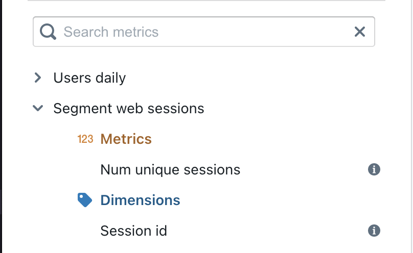

# Joins reference sheet

Joins let you connect different models to each other so that you can explore more than one model at the same time in Lightdash and see how different parts of your data relate to each other.

---

## Adding joins in your models

Joins are defined at the same level as your model parameters in your YAML file.

:::info

All joins are defined as `LEFT OUTER` joins.

:::

```version: 2

models:
  - name: users
    meta:
      joins:
        - join: web_sessions
          sql_on: ${web_sessions.user_id} = ${users.user_id}
        - join: subscriptions
          sql_on: ${subscriptions.user_id} = ${users.user_id} AND ${subscriptions.is_active}

    columns:
      - name: user_id
        meta:
          metrics:
            num_unique_user_ids:
              type: count_distinct
```

When you open Lightdash, your joined models' dimensions and metrics will appear below the ones in your selected model.



## Using joined dimensions or metrics in your .yml

Once you've joined a model, you can reference the metrics and dimensions from your joined model in your configurations. 

For example, I can filter one of my metrics using a dimension from my joined model, like this:

```yaml
version: 2

models:
  - name: users
    meta:
      joins:
        - join: web_sessions
          sql_on: ${web_sessions.user_id} = ${users.user_id}
        - join: subscriptions
          sql_on: ${subscriptions.user_id} = ${users.user_id} AND ${subscriptions.is_active}

    columns:
      - name: user_id
        meta:
          metrics:
            num_unique_premium_user_ids:
              type: count_distinct
              filters:
                - subscriptions.plan: premium
```

You can also reference these joined metrics and dimensions in custom sql, like this:

```yaml
version: 2

models:
  - name: users
    meta:
      joins:
        - join: web_sessions
          sql_on: ${web_sessions.user_id} = ${users.user_id}
        - join: subscriptions
          sql_on: ${subscriptions.user_id} = ${users.user_id} AND ${subscriptions.is_active}

    columns:
      - name: user_id
        meta:
          dimension:
            sql: IF(${subscriptions.plan} IS NULL, NULL, ${user_id})
          metrics:
            num_unique_premium_user_ids:
              type: count_distinct
              sql: IF(${subscriptions.plan} = 'premium', ${user_id}, NULL)
```

Check out our [dimensions](/references/dimensions) and [metrics](/references/metrics) reference docs to see all of the other configurations you can use with your joined fields.
